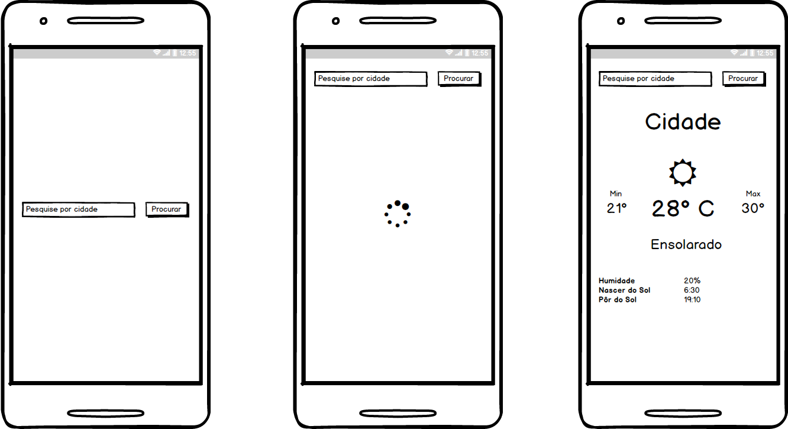

# REGRAS GERAIS

- O projeto deve ser feito em Java e/ou Kotlin
- Você pode usar quaisquer bibliotecas de terceiros
- O aplicativo não pode quebrar

O teste serve para analisar:

- Seu conhecimento geral sobre Android
- Como você organiza/estrutura seu código
- Sua habilidade de lidar com uma API REST
- Sua habilidade de entender uma documentação

Você deverá criar um aplicativo de previsão do tempo, onde requisitos são:

- Deve ser possível pesquisar a previsão do tempo para uma cidade
- Exibir a previsão caso disponível
- Tratar erro caso a previsão esteja indisponível, ou acontece algo inesperado(ex: problema de rede)

Para conseguir realizar essa tarefa você deverá utilizar a popular api do OpenWeatherMap (http://openweathermap.org/)
O mock das telas do que é desejavel que tenha no aplicativo, você pode dar um toque seu no design/layout, o importante é exibir ao menos a informação básica do que for retornado pelo OpenWeatherMap.

Seria desejável(não obrigatório)
- Utilizar algum padrão arquitetural(MVP, MVVM, VIPER, etc...)
- Testes unitários
- Testes de interface

# IMPORTANTE
Caso utilize o mecanismo try/catch NÃO deixe o bloco catch vazio

# RESULTADO

